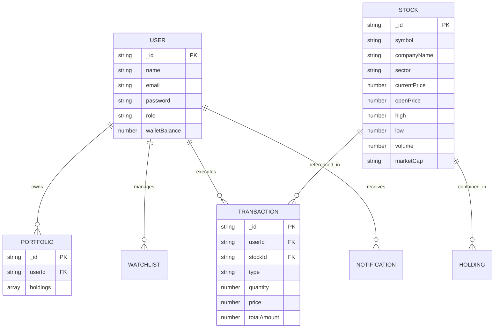

# GrowwTrade & Angel One Inspired Stock Trading Platform 🚀🇮🇳

**GrowwTrade** is your one-stop destination for effortless paper trading, stock market tracking, and options trading. Designed and implemented with clean **MERN Stack architecture** (MongoDB, Express, React Vite, Node.js) and modern **Glassmorphism UI** visual design aesthetics.

---

## 🔗 DEMO AND GITHUB REPOSITORY LINKS

> [!IMPORTANT]
> - ⚡ **Live Render Backend API**: [https://stocktrade-backend.onrender.com](https://stocktrade-backend.onrender.com)
> - 📦 **GitHub Repository**: [https://github.com/sabarid123/Nasscom](https://github.com/sabarid123/Nasscom)
> - 📁 **Project Documentation**: [https://drive.google.com/drive/folders/1z7AhqxIhjlWVp2_6LKseVn3Vqmax5sWQ?usp=sharing](https://drive.google.com/drive/folders/1z7AhqxIhjlWVp2_6LKseVn3Vqmax5sWQ?usp=sharing)
> - 🔑 **Pre-configured User Accounts**:
>   - **Trader Email**: `user@stocktrade.com` | **Password**: `UserPassword123!` (Balance: **₹5,00,000**)
>   - **Admin Email**: `admin@stocktrade.com` | **Password**: `AdminPassword123!` (Balance: **₹1,00,000,000**)

---

## 1. PROJECT ARCHITECTURE

### TECHNICAL ARCHITECTURE

The application follows a decoupled client-server architecture:

```text
+-----------------------------------------------------------------------+
|                            FRONTEND LAYER                             |
| - React 18 (Vite Build System)                                        |
| - Glassmorphism Design Tokens & Vanilla CSS / Bootstrap 5 System      |
| - Context API (AuthContext, SocketContext, NotificationContext)      |
| - React Router DOM Navigation                                         |
| - Pages: Home, Dashboard, StockDetails, Portfolio, Watchlist,         |
|   Transactions, OptionChain, IpoMutualFunds, Admin Dashboard          |
+-----------------------------------------------------------------------+
                                   |
                                   | REST API (HTTP / JSON) & WebSockets
                                   v
+-----------------------------------------------------------------------+
|                            BACKEND LAYER                              |
| - Node.js & Express.js REST API Server                                |
| - Socket.io Real-Time Stock Price Feed Dispatcher                     |
| - JWT Authentication & Bcrypt Hashing Middleware                      |
| - Controllers: AuthController, StockController, TradeController,      |
|   PortfolioController, WatchlistController, AdminController           |
+-----------------------------------------------------------------------+
                                   |
                                   | Mongoose ORM
                                   v
+-----------------------------------------------------------------------+
|                            DATABASE LAYER                             |
| - MongoDB (Users, Stocks, Portfolios, Watchlists, Transactions)       |
+-----------------------------------------------------------------------+
```

### ER DIAGRAM



---

## FEATURES

1. **Live Indian Market Indices Ticker**: Top sticky navigation header featuring live **NIFTY 50**, **BANK NIFTY**, **SENSEX**, and **FINNIFTY** tickers with point & percentage change indicators.
2. **40+ Top Growing Indian Companies Across 8 Sectors**: Live market prices in **INR (₹)** for blue-chip companies including RELIANCE, TCS, INFY, HDFCBANK, ICICIBANK, SBIN, BHARTIARTL, TATASTEEL, ZOMATO, LT, ITC, WIPRO, HAL, MARUTI, SUNPHARMA across 8 major industry sectors.
3. **Instant Order Ticket Modal (`OrderModal`)**: Features **Delivery (CNC)** vs **Intraday (MIS)** order types, **Market Price** vs **Limit Price** options, live margin requirement calculation, and instant balance checks.
4. **F&O Option Chain (`/option-chain`)**: Interactive options chain matrix for NIFTY 50, BANK NIFTY, RELIANCE, and TCS featuring Call Options (CE), Put Options (PE), Strike Prices (ITM/ATM/OTM), Open Interest (OI Lakhs), Implied Volatility (IV %), and quick B/S buttons.
5. **IPOs & Mutual Funds Hub (`/ipo-mf`)**: Initial Public Offerings (IPOs) listing (Hyundai Motor India, Swiggy, NTPC Green) with Grey Market Premium (GMP), Lot Size, & 1-click Bidding. Direct Mutual Funds directory with 3Y Annualized Return %, Risk Badges & Instant Investment.
6. **Order Book Market Depth & Interactive Charts**: Real-time top 5 Best Bids and Best Asks order book view in stock details with timeframe selector buttons (**1D, 1W, 1M, 1Y, ALL**).
7. **Live Portfolio Tracker & Wallet Balance**: Multi-asset holdings valuation with dynamic P&L updates on real-time Socket ticks and pre-funded **₹5,00,000** demo trading balance.

---

## USER FLOW

```text
[ Visitor / Customer ]
       |
       v
[ Browse Dashboard / Stock Catalog ]
       |
       +---> Click "Stock Details" ---> View Chart, Fundamentals & Market Depth
       |
       +---> Click "BUY / SELL" ---> Open OrderModal (Delivery CNC / Intraday MIS)
       |
       +---> Navigate to "F&O Options" ---> View Option Chain CE/PE Strike Prices
       |
       +---> Navigate to "IPOs & MF" ---> Apply for IPO Lots or Invest in Mutual Funds
       |
       +---> View "Portfolio" ---> Track Real-time Value, Holdings & P&L
```

---

## MVC PATTERN EXPLANATION

- **Model Layer (`server/models/`)**: Mongoose schemas defining data structures for `User.js`, `Stock.js`, `Portfolio.js`, `Watchlist.js`, `Transaction.js`, `Notification.js`.
- **View Layer (`client/src/`)**: Dynamic React components rendered with glassmorphism CSS backdrop filters, responsive grid structures, interactive modals, and Socket live feeds.
- **Controller Layer (`server/controllers/`)**: Business logic processing user requests, performing database CRUD operations, and returning structured JSON API payloads (`stockController.js`, `tradeController.js`, `portfolioController.js`, `watchlistController.js`, `authController.js`).

---

## 2. PROJECT SETUP AND CONFIGURATION

### Folder Structure

```text
StockTradingApp/
├── client/          # Vite + React Frontend
├── server/          # Node.js + Express Backend REST API & WebSockets
├── vercel.json      # Deployment Routing Configuration
└── README.md        # Comprehensive Project Documentation
```

### Installation Steps

#### 1. Server Setup:
```bash
cd server
npm install
```

#### 2. Client Setup:
```bash
cd client
npm install
```

---

## 3. BACKEND DEVELOPMENT

### Backend Server Configuration (`server/server.js`)
- Express app mounting routes: `/api/v1/auth`, `/api/v1/stocks`, `/api/v1/trade`, `/api/v1/portfolio`, `/api/v1/watchlist`.
- Middleware: CORS enabled, JSON parsing, Cookie parser, JWT token validation.

### Database Seeding:
Populates default trader and admin accounts alongside 42 top growing Indian blue-chip stocks:
```bash
cd server
npm run seed
```

---

## 4. DATABASE DEVELOPMENT (MongoDB)

- **MongoDB URI**: `mongodb+srv://.../stock_trading_db`
- **Database Connector**: `server/config/db.js` using Mongoose ORM with connection pooling.

---

## 5. FRONTEND DEVELOPMENT

Built with **React 18**, **Vite**, **Bootstrap 5**, **Chart.js**, and **Vanilla CSS** styled with **Glassmorphism Design System** (`glass-card`, `glass-input`, `glass-nav`, backdrop blurs, glow borders, and responsive flex/grid layouts).

---

## 6. PROJECT EXECUTION

### Step 1: Start Backend API Server
```bash
cd server
npm run seed
npm run dev
# Running on http://localhost:5000
```

### Step 2: Start Frontend React Server
```bash
cd client
npm run dev
# Running on http://localhost:5173
```

---

## 🔗 DEMO & EVALUATION LINKS SUMMARY

- **GitHub Repository**: [https://github.com/sabarid123/Nasscom](https://github.com/sabarid123/Nasscom)
- **Project Documentation**: [https://drive.google.com/drive/folders/1z7AhqxIhjlWVp2_6LKseVn3Vqmax5sWQ?usp=sharing](https://drive.google.com/drive/folders/1z7AhqxIhjlWVp2_6LKseVn3Vqmax5sWQ?usp=sharing)
- **Live Render Backend API**: [https://stocktrade-backend.onrender.com](https://stocktrade-backend.onrender.com)
- **Trader User Email**: `user@stocktrade.com` | **Password**: `UserPassword123!`
- **Admin User Email**: `admin@stocktrade.com` | **Password**: `AdminPassword123!`
